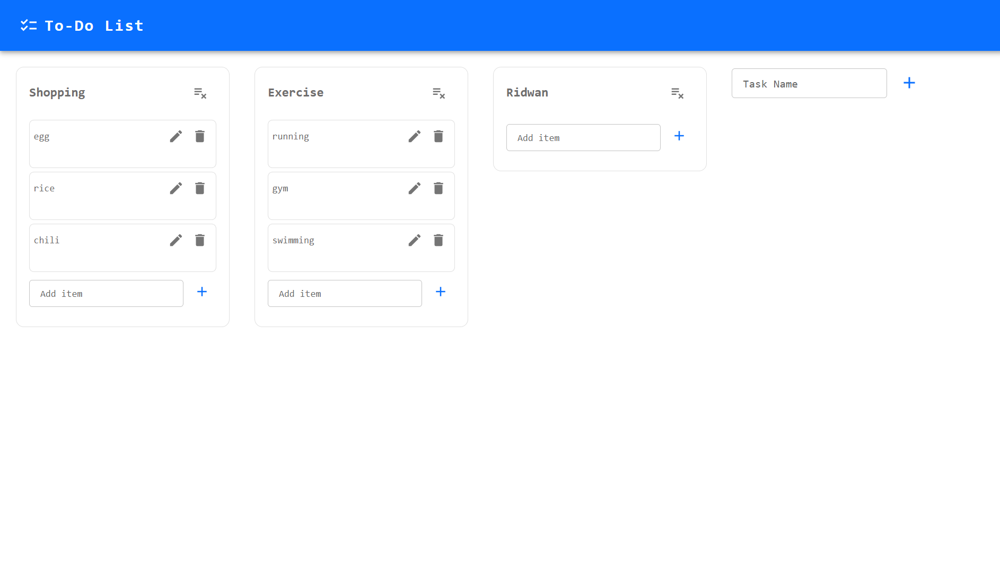
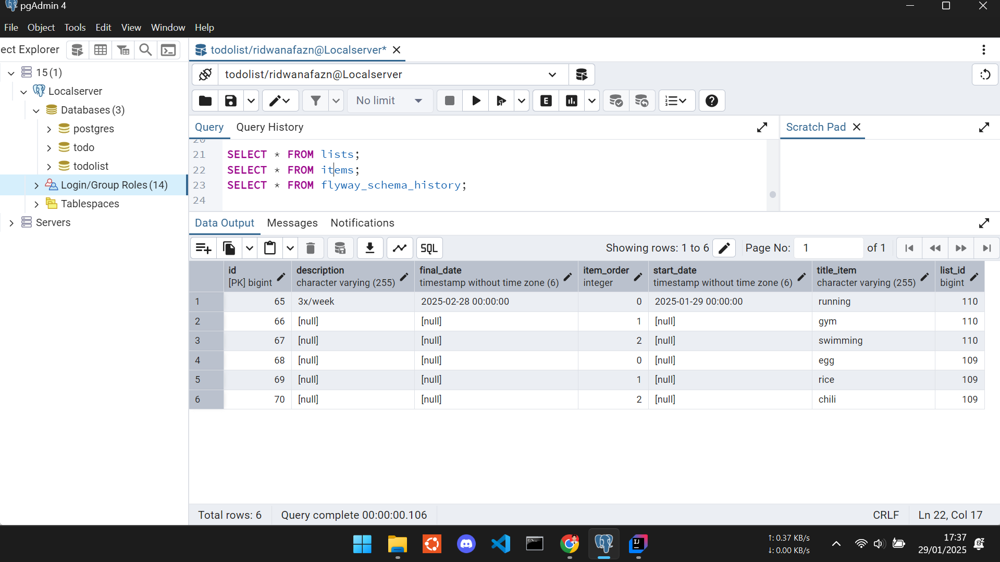

# To-Do List

A simple To-Do List API built with Spring Boot and PostgreSQL.

## Features
- Create, Read, Update, and Delete (CRUD) to-do lists and items
- Organized with list and item structure

---

## 1. Front-end

---

## 2. PostgreSQL

---

## Tech Stack
- **Backend:** Spring Boot (Java 21), Spring Data JPA
- **Database:** PostgreSQL
- **Tools:** IntelliJ IDEA, pgAdmin
